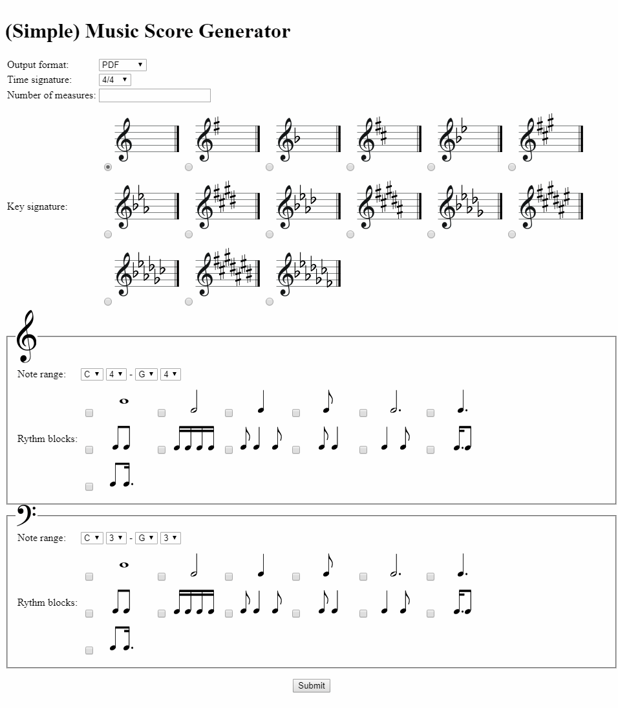
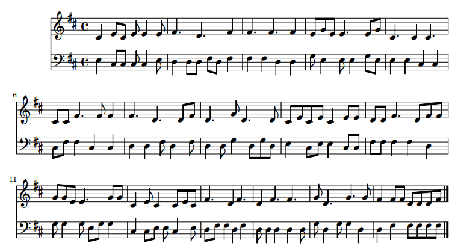

# Music Score Generator (web)
Configurable sheet music generator

It is written y C# with a minimalistic one-page ASP.NET website.

The music generation is not random: it is guided by a graph of chord progressions.

## Screenshots

## Dependencies

The application allows you to generate the lilypond script to be externally rendered or generate the PDF, for which you need to have <a href="http://lilypond.org">lilypond</a> installed.

The path to lilypond executable must be set in the web.config "lilypond.exec" app setting.
